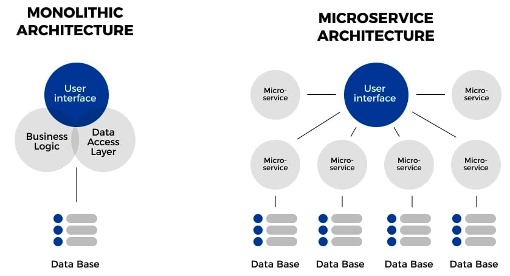
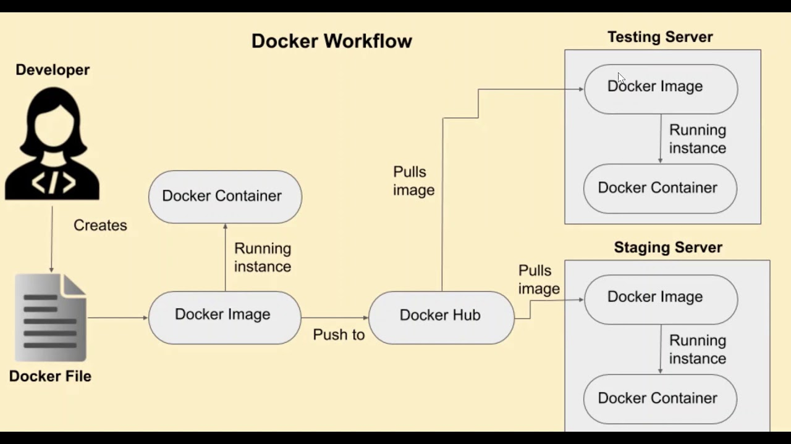
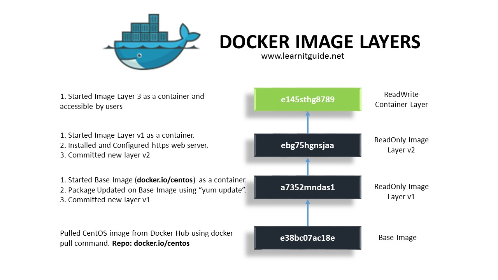
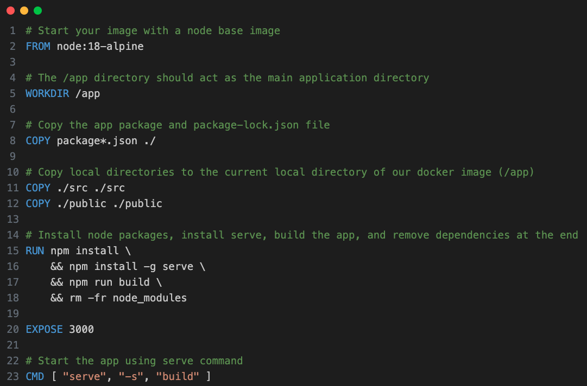
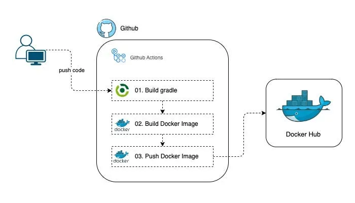
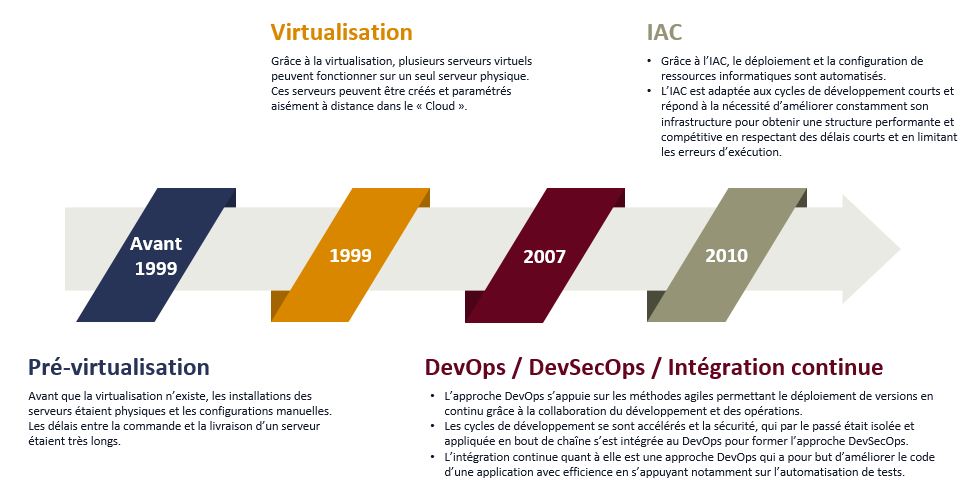
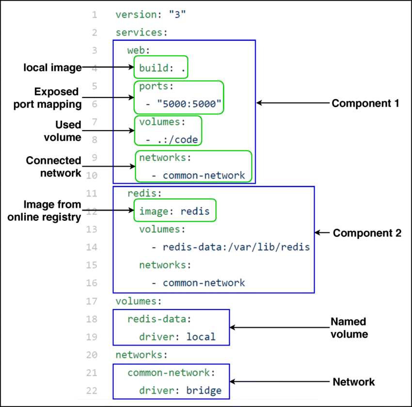

# 2 - Docker 🐋

## Conteneurisation avec Docker

### 2.1 - Introduction à la conteneurisation 
La différence entre une **architecture monolithique** et une **architecture de microservices**:

Une architecture monolithique est un modèle de développement logiciel traditionnel qui utilise une base de code unique pour exécuter plusieurs fonctions métier. Tous les composants logiciels d'un système monolithique sont interdépendants en raison des mécanismes d'échange de données au sein du système. La modification d'une architecture monolithique est contraignante et prend du temps, car de petites modifications ont un impact sur des pans entiers de la base de code. 

À l'inverse, les microservices sont une approche architecturale qui consiste à décomposer le logiciel en petits composants ou services indépendants. Chaque service joue un rôle unique et communique avec les autres services au moyen d'une interface bien définie. Comme ils s'exécutent indépendamment, vous pouvez mettre à jour, modifier, déployer ou mettre à l'échelle chaque service selon vos besoins.

 

### 2.2 - Installation de Docker 
**Docker CE (Community Edition)** est la version gratuite et open-source. 
**Docker EE (Enterprise Edition)** est la version payante avec des fonctionnalités supplémentaires incluant un support premium, des outils avancés de sécurité et de gestion.

Un lab pour s'entrainer:
- **[Labs play with docker](https://labs.play-with-docker.com/)** 

Installation de Docker sur une machine locale:
- **[Install Docker Desktop on Linux](https://docs.docker.com/desktop/install/linux-install/)** 
- **[Install Docker Desktop on Mac](https://docs.docker.com/desktop/install/mac-install/)** 
- **[Install Docker Desktop on Windows](https://docs.docker.com/desktop/install/windows-install/)** 

Installation de Docker sur un serveur Linux:
- **[Install Docker Engine on Debian](https://docs.docker.com/engine/install/debian/)** 
- **[Install Docker Engine on Ubuntu](https://docs.docker.com/engine/install/ubuntu/)** 
- **[Install Docker Engine on CentOS](https://docs.docker.com/engine/install/centos/)** 

Installation de Docker sur un serveur Microsoft:
- **[Docker sur Windows](https://learn.microsoft.com/fr-fr/windows/dev-environment/docker/overview)** 

Docker Machine est très utile si Docker **n'est pas installé nativement**.
- **[Déployer et gérer vos hôtes docker avec Docker Machine](https://devopssec.fr/article/deployer-gerer-vos-hotes-docker-avec-docker-machine)** 

L'installation de Docker sur une plateforme **PaaS** (Platform as a Service) varie en fonction du fournisseur de cloud, maisvoici les options principales :

- **Google Cloud (GCP)** : Google Kubernetes Engine (GKE) pour gérer des conteneurs Docker sur un cluster Kubernetes. GKE est un service managé qui prend en charge Docker et Kubernetes nativement.

- **Amazon Web Services (AWS)** : Amazon Elastic Container Service (ECS) et Amazon Elastic Kubernetes Service (EKS) pour exécuter et gérer des conteneurs Docker sur des clusters ECS ou Kubernetes.

- **Microsoft Azure** : Azure Kubernetes Service (AKS) permet de déployer des conteneurs Docker dans un environnement Kubernetes managé, utiliser Azure App Service pour exécuter directement des conteneurs Docker.

### 2.3 - Gestion des images 
Docker workflow: 
 

Anatomie d'une image Docker: 
 

Dockerfile qui contient les instructions pour créer une image Docker d'une application Node.js basée sur Alpine 
**[Lien du repository Docker](https://github.com/docker/welcome-to-docker/blob/main/Dockerfile)** 
 

Documentation officielle Docker pour créer un Dockerfile: 
**[Writing a Dockerfile](https://docs.docker.com/get-started/docker-concepts/building-images/writing-a-dockerfile/)** 

Développement d'une application Web Python de base avec docker-compose: 
**[Docker Compose Quickstart](https://overcast.blog/build-push-the-docker-image-to-docker-hub-using-github-actions-74f20d47c483)** 

Automatiser une mise à jour d'une image docker depuis github vers dockerhub: 
**[Build & Push the Docker image to Docker Hub using GitHub Actions](https://docs.docker.com/compose/gettingstarted/)** 
 

### 2.4 - Gestion des réseaux 
Docker network: 
**[Manage networks. You can use subcommands to create, inspect, list, remove, prune, connect, and disconnect networks](https://docs.docker.com/reference/cli/docker/network/)** 
 

### 2.5 - Gestion du stockage 
Docker storage: 
**[Storage - volumes, bind mounts, and tmpfs](https://docs.docker.com/engine/storage/)** 
 

### 2.6 - Introduction à l'IAC 
Infrastructure as code Timeline 
 

### 2.7 Docker compose: 
 
Convertir un *dockerfile* en *docker-compose*: **[composerize](https://www.composerize.com/)** 

### 2.8 - Introduction à l'orchestration avec Swarm 
### 2.9 - Mise en place d'un Registre Privé 
### 2.10 - Build Multistage 
### 2.11 - Sécurité des images Docker 
### 2.12 - Docker dans le Cloud 
### 2.13 - Mini projet 
